# 🇧🇩 Agentic - AI Agent System

<div align="center">


**A powerful AI agent system built with love from Bangladesh 🇧🇩**

[](https://en.wikipedia.org/wiki/Bangladesh)
[](https://choosealicense.com/licenses/mit/)
[](https://www.docker.com/)
[](https://www.typescriptlang.org/)
[](https://www.python.org/)

</div>

## 🚀 Features

- **Multi-Agent System**: Support for multiple AI agents with different capabilities
- **Browser Automation**: Automated web browsing using Playwright and Selenium
- **MCP Integration**: Model Context Protocol servers for extended functionality
- **Real-time Communication**: WebSocket support for live interactions
- **Session Management**: Persistent conversation sessions with Redis and MongoDB
- **VNC Visualization**: Remote desktop viewing for browser automation

## 🏗️ Architecture

```mermaid
graph TB
    subgraph "🇧🇩 System Architecture"
        Frontend[🎨 Vue.js Frontend]
        Backend[⚡ FastAPI Backend]
        Database[(🗄️ MongoDB + Redis)]
        Browser[🌐 Browser Automation]
    end
    
    Frontend <--> Backend
    Backend <--> Database
    Backend <--> Browser
```



## 🛠️ Quick Start

### Prerequisites

```bash
✅ Docker & Docker Compose
✅ Node.js 20+
✅ Python 3.11+
```

### Using Docker (Recommended)

```bash
# Clone and start
git clone <repository-url>
cd Agentic
docker-compose up --build

# Access points:
# Frontend: http://localhost:5173
# Backend API: http://localhost:8000
# Health Check: http://localhost:8000/health
```

### Local Development

```bash
# Frontend
cd frontend
npm install
npm run dev

# Backend
cd backend
pip install -r requirements.txt
python main.py
```

## 🔧 Configuration

Create `.env` file in backend directory:

```env
# Server
HOST=0.0.0.0
PORT=8000

# Database
REDIS_URL=redis://localhost:6379
MONGODB_URL=mongodb://localhost:27017

# API Keys
OPENAI_API_KEY=your_openai_key
ANTHROPIC_API_KEY=your_anthropic_key

# Security
SECRET_KEY=your-secret-key
JWT_SECRET_KEY=your-jwt-secret
```

## 📚 Documentation

- [Frontend Setup](frontend/README.md)
- [Backend Setup](backend/README.md)
- [Docker Guide](DOCKER.md)
- [API Reference](docs/api.md)

## 🧪 Testing

```bash
# Frontend tests
cd frontend && npm run test

# Backend tests
cd backend && python -m pytest
```

## 🚀 Deployment

```bash
# Production build
cd frontend && npm run build
docker build -t agentic-system .
docker-compose -f docker-compose.prod.yml up -d
```

## 🤝 Contributing

1. Fork the repository
2. Create a feature branch
3. Make your changes
4. Add tests
5. Submit a pull request

## 📄 License

This project is licensed under the MIT License - see the [LICENSE](LICENSE) file for details.

<div align="center">

---

**Made with ❤️ in Bangladesh 🇧🇩**

</div>