# 🇧🇩 Agentic - AI Agent System

<div align="center">


**A powerful AI agent system built with love from Bangladesh 🇧🇩**

*Bridging innovation from the Land of the Bengal Tiger to the world*

[](https://en.wikipedia.org/wiki/Bangladesh)
[](https://choosealicense.com/licenses/mit/)
[](https://www.docker.com/)
[](https://www.typescriptlang.org/)
[](https://www.python.org/)

[🚀 Quick Start](#-quick-start) • [📚 Documentation](#-documentation) • [🌟 Features](#-features) • [🤝 Contributing](#-contributing)

</div>

---

## 🌟 Features

<div align="center">

### 🏛️ **Shohid Minar of AI Architecture**
*Standing tall with multi-layered intelligence*

</div>

#### 🤖 **Multi-Agent Intelligence**
- **Autonomous AI Agents**: Like the entrepreneurial spirit of Bangladesh
- **Collaborative Workflows**: Working together like the unity of '71
- **Adaptive Learning**: Constantly evolving like our growing tech industry

#### 🌐 **Browser Automation**
- **Playwright Integration**: Smooth as the Padma River flow
- **Selenium Support**: Reliable as the rickshaw transportation
- **Real-time Visualization**: Clear as the view from Cox's Bazar

#### 🔗 **MCP Protocol Integration**
- **Model Context Protocol**: Standards as strong as our jute fiber
- **Tool Orchestration**: Coordinated like the rhythm of traditional music
- **Extensible Architecture**: Growing like the mangrove forests of Sundarbans

#### 🔥 **Modern Tech Stack**

```mermaid
graph TB
    subgraph "🇧🇩 Made in Bangladesh"
        Frontend[🎨 Vue.js 3 + TypeScript<br/>Modern & Responsive]
        Backend[⚡ FastAPI + Python<br/>High Performance]
        Database[(🗄️ MongoDB + Redis<br/>Scalable Storage)]
        Container[🐳 Docker + Compose<br/>Cloud Ready]
    end
    
    Frontend --> Backend
    Backend --> Database
    Container --> Frontend
    Container --> Backend
    Container --> Database
```


---

## 🏗️ **Architecture Overview**

<div align="center">

### 🏢 **Dhaka's Tech Hub Inspired Design**

</div>

```
🇧🇩 Agentic System Architecture
├── 🎨 frontend/          # Vue.js - Beautiful as Dhaka's skyline
├── ⚡ backend/           # FastAPI - Fast as Dhaka Metro
├── 🐳 docker/            # Containers - Organized as Old Dhaka
├── 📊 monitoring/        # Observability - Clear as Sylhet tea gardens
├── 🔧 tools/             # Utilities - Handy as Bengali innovations
└── 📚 docs/              # Documentation - Comprehensive as our literature
```

### 🌊 **Data Flow Architecture**

```mermaid
flowchart LR
    subgraph "🇧🇩 Bangladesh Tech Stack"
        UI[🎨 Vue.js Frontend<br/>Port: 5173]
        API[⚡ FastAPI Backend<br/>Port: 8000]
        DB[(🗄️ MongoDB<br/>Port: 27017)]
        Cache[(⚡ Redis<br/>Port: 6379)]
        Browser[🌐 Browser Automation<br/>Playwright/Selenium]
    end
    
    UI <--> API
    API <--> DB
    API <--> Cache
    API <--> Browser
    
    style UI fill:#006747,stroke:#da291c,color:#fff
    style API fill:#006747,stroke:#da291c,color:#fff
    style DB fill:#006747,stroke:#da291c,color:#fff
    style Cache fill:#006747,stroke:#da291c,color:#fff
    style Browser fill:#006747,stroke:#da291c,color:#fff
```



---

## 🚀 **Quick Start**

<div align="center">

### 🏃‍♂️ **Get Running Faster than Dhaka Traffic!**

</div>

### 📋 **Prerequisites**

```bash
# Required tools (as essential as rice and fish!)
✅ Docker & Docker Compose  # Container orchestration
✅ Node.js 20+             # JavaScript runtime
✅ Python 3.11+            # Backend language
✅ Git                     # Version control
```

### 🐳 **Docker Setup (Recommended)**

```bash
# 1. Clone from the digital Bangladesh
git clone https://github.com/likhonwrk/Agentic.git
cd Agentic

# 2. Launch the system (faster than launching a rocket from Bangabandhu Satellite)
docker-compose up --build -d

# 3. Check system health (healthy as our traditional diet)
curl http://localhost:8000/health
```

### 🌟 **Access Points**

<div align="center">

| Service | URL | Description |
|---------|-----|-------------|
| 🎨 **Frontend** | http://localhost:5173 | Modern Vue.js Interface |
| ⚡ **Backend API** | http://localhost:8000 | FastAPI Documentation |
| 📊 **Health Check** | http://localhost:8000/health | System Status |
| 🐳 **Docker Dashboard** | http://localhost:9000 | Container Management |

</div>

---

## 🛠️ **Development Setup**

<div align="center">

### 👨‍💻 **Local Development - Dhaka Style**

</div>

#### 🎨 **Frontend Development**

```bash
# Navigate to frontend (like navigating Old Dhaka streets)
cd frontend

# Install dependencies (faster than installing love for biryani)
npm install

# Start development server
npm run dev

# Your app will be running at http://localhost:5173
```

#### ⚡ **Backend Development**

```bash
# Navigate to backend
cd backend

# Create virtual environment (isolated like our beautiful islands)
python -m venv .venv
source .venv/bin/activate  # Linux/Mac
# or
.venv\Scripts\activate     # Windows

# Install dependencies
pip install -r requirements.txt

# Start the backend server
python main.py
```

---

## 🔧 **Configuration**

<div align="center">

### ⚙️ **Setup Configuration - Precision like Bengali craftsmanship**

</div>

### 🌍 **Environment Variables**

Create `.env` file in the backend directory:

```env
# 🇧🇩 Server Configuration
HOST=0.0.0.0
PORT=8000
ENVIRONMENT=development

# 🗄️ Database Configuration (Secure as Fort Lalbagh)
REDIS_URL=redis://localhost:6379/0
MONGODB_URL=mongodb://localhost:27017/agentic
DATABASE_NAME=agentic_bd

# 🤖 AI Service Keys
OPENAI_API_KEY=your_openai_key_here
ANTHROPIC_API_KEY=your_anthropic_key_here
GOOGLE_API_KEY=your_google_key_here

# 🔐 Security Configuration (Strong as our Liberation War spirit)
SECRET_KEY=your-super-secret-key-as-strong-as-bengali-resolve
JWT_SECRET_KEY=your-jwt-secret-key-here
JWT_ALGORITHM=HS256
ACCESS_TOKEN_EXPIRE_MINUTES=30

# 🔧 MCP Configuration
MCP_CONFIG_PATH=./mcp-config.json
ENABLE_BROWSER_AUTOMATION=true
MAX_CONCURRENT_SESSIONS=100

# 🌐 CORS Configuration
ALLOWED_ORIGINS=["http://localhost:5173","http://localhost:3000"]

# 📊 Monitoring (Watchful as the Royal Bengal Tiger)
LOG_LEVEL=INFO
ENABLE_METRICS=true
METRICS_PORT=8001
```

### 🔗 **MCP Server Configuration**

Perfect VS Code integration for Bangladesh developers:

```json
{
  "mcpServers": {
    "agentic-bangladesh": {
      "command": "python",
      "args": ["-m", "backend.core.mcp_integration"],
      "env": {
        "PYTHONPATH": "${workspaceFolder}",
        "BANGLADESHI_LOCALE": "bn_BD",
        "TIMEZONE": "Asia/Dhaka"
      },
      "cwd": "${workspaceFolder}"
    },
    "browser-automation": {
      "command": "npx",
      "args": ["-y", "@microsoft/playwright-mcp"],
      "env": {
        "DISPLAY": ":99",
        "LANG": "bn_BD.UTF-8"
      }
    },
    "github-integration": {
      "command": "npx",
      "args": ["-y", "@modelcontextprotocol/server-github"],
      "env": {
        "GITHUB_TOKEN": "${env:GITHUB_TOKEN}",
        "GIT_AUTHOR_NAME": "Bangladesh Developer",
        "GIT_AUTHOR_EMAIL": "dev@bangladesh.com"
      }
    }
  }
}
```

---

## 📡 **API Documentation**

<div align="center">

### 🛣️ **API Routes - Well planned like Dhaka's future roadmap**

</div>

### 🗨️ **Chat & Session Management**

```typescript
// Session Management - Persistent like our cultural heritage
POST   /api/v1/sessions                    # Create new session
GET    /api/v1/sessions                    # List all sessions  
GET    /api/v1/sessions/{session_id}       # Get session details
DELETE /api/v1/sessions/{session_id}       # Delete session
POST   /api/v1/sessions/{session_id}/chat  # Send message (SSE)

// Agent Operations - Intelligent like our people
POST   /api/v1/agents/chat                 # Chat with AI agent
POST   /api/v1/agents/browser/execute      # Execute browser task
GET    /api/v1/agents/status               # Get agent status

// System Health - Monitoring like our healthcare progress
GET    /health                             # System health check
GET    /metrics                            # Prometheus metrics
GET    /api/v1/system/info                 # System information
```

### 📊 **Response Format**

```typescript
interface APIResponse<T> {
  success: boolean
  data?: T
  message?: string
  error_code?: string
  timestamp: string
  request_id: string
  execution_time_ms: number
}

// Example successful response
{
  "success": true,
  "data": {
    "session_id": "sess_bd_123456",
    "status": "active",
    "created_at": "2025-01-01T06:00:00Z"
  },
  "message": "Session created successfully",
  "timestamp": "2025-01-01T06:00:01Z",
  "request_id": "req_bd_789012",
  "execution_time_ms": 45
}
```

---

## 🧪 **Testing**

<div align="center">

### 🔬 **Quality Assurance - Thorough like our academic excellence**

</div>

### 🎯 **Frontend Testing**

```bash
# Unit tests (Sharp as our wit)
cd frontend
npm run test:unit

# Integration tests (Connected like our rivers)
npm run test:integration

# E2E tests (Complete like our traditional stories)
npm run test:e2e

# Coverage report (Comprehensive like our monsoon)
npm run test:coverage
```

### 🔍 **Backend Testing**

```bash
# Run all tests (Thorough like our attention to detail)
cd backend
python -m pytest

# With coverage (Complete as our national anthem)
python -m pytest --cov=. --cov-report=html

# Performance tests (Fast like our economic growth)
python -m pytest tests/performance/

# Load testing (Strong like our resolve)
locust -f tests/load_testing.py --host=http://localhost:8000
```

---

## 🚀 **Deployment**

<div align="center">

### 🌍 **Production Deployment - Global reach from Bangladesh**

</div>

### 🏭 **Production Build**

```bash
# Build frontend for production (Polished like our traditional crafts)
cd frontend
npm run build

# Build backend (Optimized like our resource management)
cd backend
pip install --no-dev

# Create production Docker image
docker build -t agentic-bangladesh:latest .

# Deploy with Docker Compose
docker-compose -f docker-compose.prod.yml up -d
```

### ☁️ **Cloud Deployment Options**

<div align="center">

| Platform | Configuration | Benefits |
|----------|--------------|----------|
| 🌐 **AWS** | `deploy/aws/` | Global CDN, Auto-scaling |
| ☁️ **Google Cloud** | `deploy/gcp/` | AI/ML Integration |
| 🔵 **Azure** | `deploy/azure/` | Enterprise Features |
| 🌊 **DigitalOcean** | `deploy/do/` | Developer Friendly |

</div>

---

## 🔧 **Troubleshooting**

<div align="center">

### 🛠️ **Common Issues - Solutions like our problem-solving heritage**

</div>

### ❗ **Docker Issues**

```bash
# Container won't start (Like solving traffic jams)
docker-compose down -v
docker system prune -f
docker-compose up --build

# Permission issues (Clear as our democratic process)
sudo chown -R $USER:$USER ./data
chmod +x scripts/*.sh

# Port conflicts (Organized like our city planning)
netstat -tulpn | grep :8000
sudo lsof -i :8000
```

### 🐛 **Application Issues**

```bash
# Backend debugging (Detailed like our investigation skills)
docker-compose logs backend

# Frontend debugging (Clear as our communication)
docker-compose logs frontend

# Database connection (Reliable like our friendship bonds)
docker-compose exec mongodb mongo --eval "db.stats()"
docker-compose exec redis redis-cli ping
```

### 📊 **Performance Issues**

```bash
# Monitor resource usage (Efficient like our resource management)
docker stats

# Check API performance (Fast like our hospitality)
curl -w "@curl-format.txt" -o /dev/null -s http://localhost:8000/health

# Database performance (Optimized like our agricultural techniques)
docker-compose exec mongodb mongostat
```

---

## 🤝 **Contributing**

<div align="center">

### 💝 **Join Our Community - Welcome like guests in Bangladesh**

</div>

We welcome contributions from developers around the world! 🌍

### 🌟 **How to Contribute**

1. **Fork the repository** 🍴
   ```bash
   git clone https://github.com/yourusername/Agentic.git
   ```

2. **Create feature branch** 🌿
   ```bash
   git checkout -b feature/amazing-feature
   ```

3. **Make your changes** ✨
   - Follow our coding standards
   - Add comprehensive tests
   - Update documentation

4. **Commit with style** 📝
   ```bash
   git commit -m "feat: add amazing feature 🚀"
   ```

5. **Push and create PR** 🚀
   ```bash
   git push origin feature/amazing-feature
   ```

### 📋 **Contribution Guidelines**

- **Code Style**: Follow TypeScript/Python best practices
- **Testing**: Maintain >90% code coverage
- **Documentation**: Update docs for any API changes
- **Bengali Comments Welcome**: Feel free to add comments in Bengali! 🇧🇩

---

## 👥 **Community & Support**

<div align="center">

### 🤗 **Connect with Fellow Bangladeshi Developers**

[](https://github.com/likhonwrk/Agentic/issues)
[](https://github.com/likhonwrk/Agentic/stargazers)
[](https://github.com/likhonwrk/Agentic/network)

</div>

### 📞 **Get Help**

- 🐛 **Bug Reports**: [GitHub Issues](https://github.com/likhonwrk/Agentic/issues)
- 💡 **Feature Requests**: [GitHub Discussions](https://github.com/likhonwrk/Agentic/discussions)
- 📧 **Email Support**: support@agentic-bd.com
- 💬 **Discord Community**: [Join our server](https://discord.gg/agentic-bangladesh)

---

## 📄 **License**

<div align="center">

This project is licensed under the **MIT License** - see the [LICENSE](LICENSE) file for details.

**Made with ❤️ in Bangladesh 🇧🇩**

*From the developers of the Land of Rivers to the global tech community*

</div>

---

## 🙏 **Acknowledgments**

<div align="center">

### 🌟 **Special Thanks**

</div>

- **🇧🇩 Bangladesh Tech Community**: For inspiration and support
- **🏛️ University of Dhaka**: For academic excellence tradition
- **🌊 Bay of Bengal**: For the vast possibilities it represents
- **🐅 Royal Bengal Tiger**: For the strength and majesty in our code
- **🌾 Golden Bengal**: For the rich heritage that drives innovation

### 🏆 **Built By**

**[@likhonwrk](https://github.com/likhonwrk)** - *Proud Bangladeshi Developer*

<div align="center">

---

### 🇧🇩 **"আমার সোনার বাংলা, আমি তোমায় ভালোবাসি"**
*"My Golden Bengal, I love you"*

**Empowering Bangladesh's Digital Future, One Agent at a Time** 🚀

---

[](https://visitorbadge.io/status?path=https%3A%2F%2Fgithub.com%2Flikhonwrk%2FAgentic)

</div>