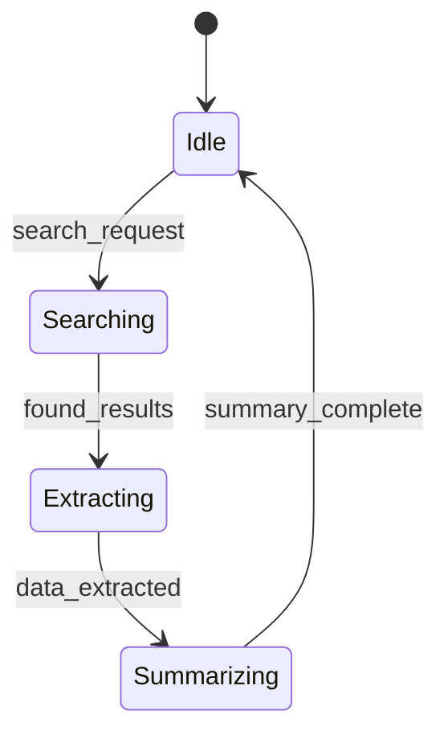

# Markdown-First Development

Agentic embraces a markdown-first development approach, allowing developers to define agents, workflows, and system behavior using plain markdown files.

## 🎯 Benefits

- **Documentation as Code**: Single source of truth for system behavior
- **Version Control**: Easy to track changes and collaborate
- **Auto-Generation**: Generate code from markdown definitions
- **Rapid Prototyping**: Quick iteration on agent behaviors
- **Clear Communication**: Easy to understand and share

## 📝 Agent Definition

```markdown
# Agent: WebResearcher
## Capabilities
- Web browsing
- Information extraction
- Document summarization

## State Machine


## Workflow Examples

### Research Workflow
1. Receive search query
2. Browse relevant pages
3. Extract key information
4. Generate summary
5. Return findings

## Configuration
```yaml
name: WebResearcher
type: autonomous
capabilities:
  - web_browsing
  - text_extraction
  - summarization
tools:
  - browser_automation
  - nlp_processing
```
```

## 🔄 State Machine Generation

Mermaid diagrams in markdown files are automatically converted to XState machines:

```typescript
import { createMachine } from 'xstate';

const researcherMachine = createMachine({
  id: 'webResearcher',
  initial: 'idle',
  states: {
    idle: {
      on: { SEARCH_REQUEST: 'searching' }
    },
    searching: {
      on: { FOUND_RESULTS: 'extracting' }
    },
    extracting: {
      on: { DATA_EXTRACTED: 'summarizing' }
    },
    summarizing: {
      on: { SUMMARY_COMPLETE: 'idle' }
    }
  }
});
```

## 🧩 Composition

Agents can be composed using markdown references:

```markdown
# Workflow: ComprehensiveResearch
## Components
- [[WebResearcher]]
- [[DataAnalyzer]]
- [[ReportGenerator]]

## Flow

```
