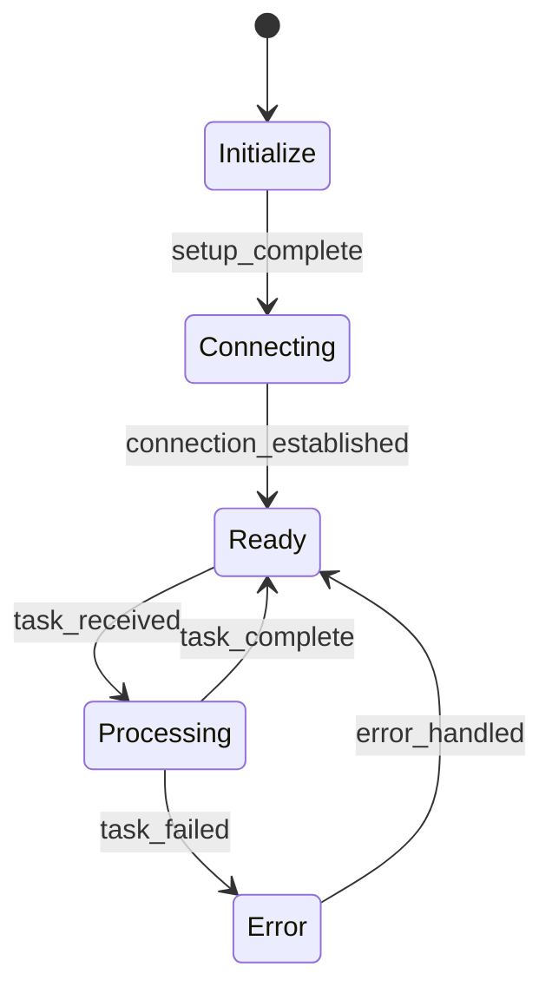

# Mermaid to XState Integration

Agentic provides seamless integration between Mermaid diagrams and XState state machines, enabling visual workflow design with automatic code generation.

## 🎯 Features

- **Visual Workflow Design**: Use Mermaid for intuitive workflow creation
- **Automatic Code Generation**: Convert diagrams to XState machines
- **Type Safety**: Generated code includes TypeScript types
- **Live Preview**: See state machine updates in real-time
- **Validation**: Verify workflow correctness visually

## 📊 Workflow Example

### 1. Define in Mermaid


### 2. Generated XState Machine
```typescript
import { createMachine, assign } from 'xstate';

interface Context {
  error?: Error;
  task?: Task;
}

type Event = 
  | { type: 'SETUP_COMPLETE' }
  | { type: 'CONNECTION_ESTABLISHED' }
  | { type: 'TASK_RECEIVED', task: Task }
  | { type: 'TASK_COMPLETE' }
  | { type: 'TASK_FAILED', error: Error }
  | { type: 'ERROR_HANDLED' };

const workflowMachine = createMachine<Context, Event>({
  id: 'workflow',
  initial: 'initialize',
  context: {},
  states: {
    initialize: {
      on: {
        SETUP_COMPLETE: 'connecting'
      }
    },
    connecting: {
      on: {
        CONNECTION_ESTABLISHED: 'ready'
      }
    },
    ready: {
      on: {
        TASK_RECEIVED: {
          target: 'processing',
          actions: assign({
            task: (_, event) => event.task
          })
        }
      }
    },
    processing: {
      on: {
        TASK_COMPLETE: {
          target: 'ready',
          actions: assign({
            task: undefined
          })
        },
        TASK_FAILED: {
          target: 'error',
          actions: assign({
            error: (_, event) => event.error
          })
        }
      }
    },
    error: {
      on: {
        ERROR_HANDLED: {
          target: 'ready',
          actions: assign({
            error: undefined
          })
        }
      }
    }
  }
});
```

## 🔄 Development Workflow

1. **Design**: Create/update Mermaid diagram in markdown
2. **Generate**: Auto-generate XState machine
3. **Implement**: Add business logic to state transitions
4. **Test**: Visualize and validate state flow
5. **Deploy**: Use in production with type safety

## 🛠️ Integration Points

### VSCode Extension
- Live preview of Mermaid diagrams
- Code generation commands
- State machine visualization

### Development Server
- Hot reload of state machines
- Visual debugger for state transitions
- Time-travel debugging

### CI/CD Integration
- Validate diagrams in CI
- Generate type definitions
- Update documentation
